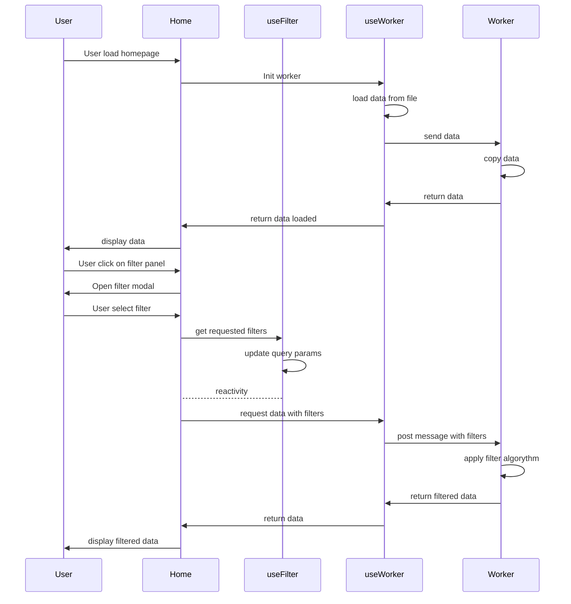

```mermaid
sequenceDiagram
participant User
participant Home
participant useFilter
participant useWorker
participant Worker

User->>Home: User load homepage
Home->>useWorker: Init worker
useWorker->>useWorker: load data from file
useWorker->>Worker: send data
Worker->>Worker: copy data
Worker->>useWorker: return data
useWorker->>Home: return data loaded
Home->>User: display data
User->>Home: User click on filter panel
Home->>User: Open filter modal
User->>Home: User select filter
Home->>useFilter: get requested filters
useFilter->>useFilter: update query params
useFilter-->Home: reactivity
Home->>useWorker: request data with filters
useWorker->>Worker: post message with filters
Worker->>Worker: apply filter algorythm
Worker->>useWorker: return filtered data
useWorker->>Home: return data
Home->>User: display filtered data


```
