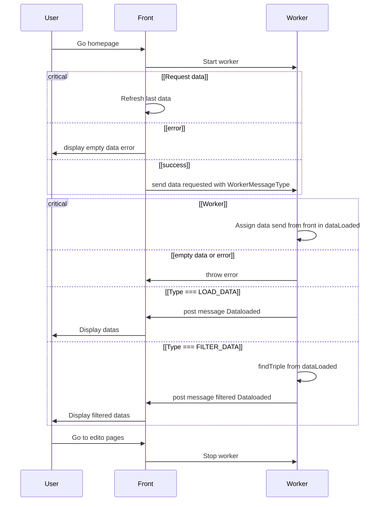

```mermaid
sequenceDiagram
participant User
participant Front
participant Worker
User->>Front: Go homepage
Front->>Worker: Start worker
critical [Request data]
Front->>Front: Refresh last data
option [error]
Front->>User: display empty data error
option [success]
Front->>Worker: send data requested with WorkerMessageType
end
critical [Worker]
Worker->>Worker: Assign data send from front in dataLoaded
option [empty data or error]
Worker->>Front: throw error
option [Type === LOAD_DATA]
Worker->>Front: post message Dataloaded
Front->>User: Display datas
option [Type === FILTER_DATA]
Worker->>Worker: findTriple from dataLoaded
Worker->>Front: post message filtered Dataloaded
Front->>User: Display filtered datas
end
User->>Front: Go to edito pages
Front->>Worker: Stop worker
```
